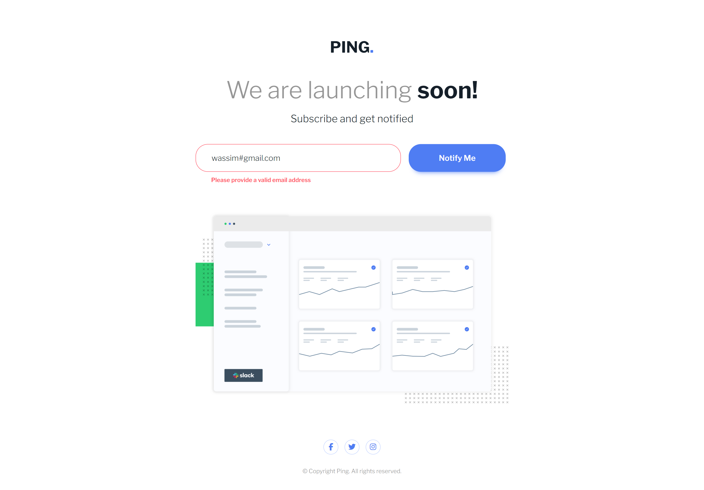
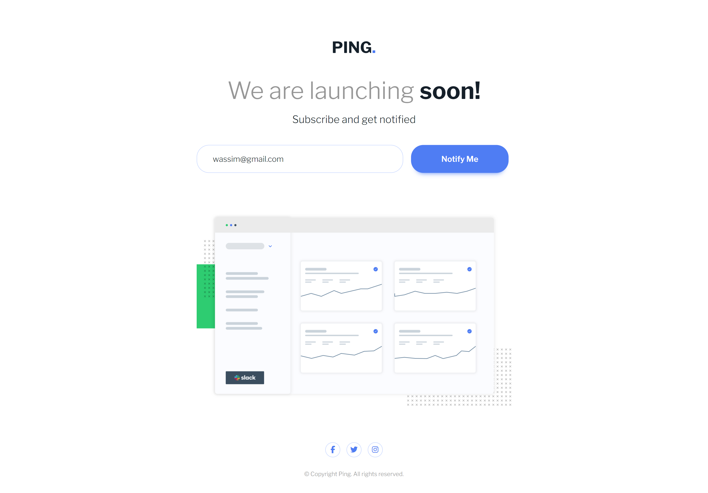
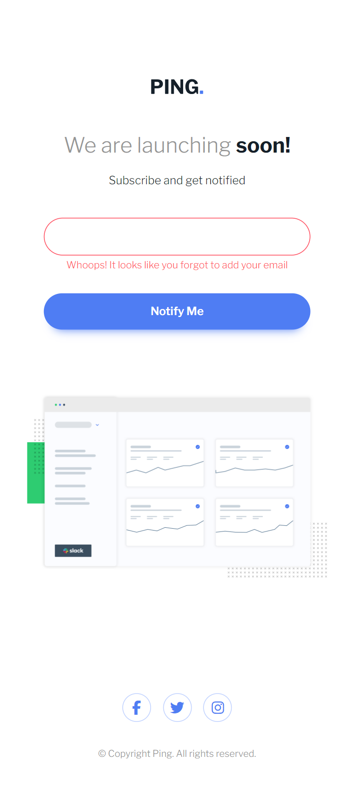
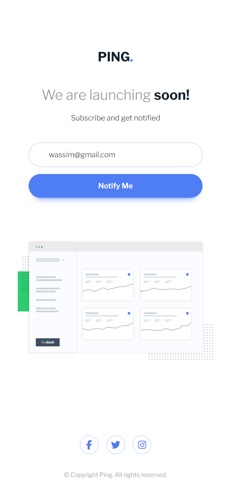

# Frontend Mentor - Ping coming soon page solution

This is a solution to the [Ping coming soon page challenge on Frontend Mentor](https://www.frontendmentor.io/challenges/ping-single-column-coming-soon-page-5cadd051fec04111f7b848da).
Frontend Mentor challenges help you improve your coding skills by building realistic projects.

## Table of contents

- [Frontend Mentor - Ping coming soon page solution](#frontend-mentor---ping-coming-soon-page-solution)
  - [Table of contents](#table-of-contents)
  - [Overview](#overview)
    - [The challenge](#the-challenge)
    - [Screenshot](#screenshot)
    - [Links](#links)
  - [My process](#my-process)
    - [Built with](#built-with)
  - [Author](#author)

## Overview

### The challenge

Users should be able to:

- View the optimal layout for the site depending on their device's screen size
- See hover states for all interactive elements on the page
- Submit their email address using an `input` field
- Receive an error message when the `form` is submitted if:
  - The `input` field is empty.
  - The email address is not formatted correctly (i.e. a correct email address should have this structure: `name@host.tld`).

### Screenshot

Desktop:

|  |  |  |  |
| :-----------------------------------------------------: | :-----------------------------------------------------: | :-----------------------------------------------------: | :-----------------------------------------------------: |

Mobile:

|  |  |  |  |
| :-----------------------------------------------------: | :-----------------------------------------------------: | :-----------------------------------------------------: | :-----------------------------------------------------: |

### Links

- [Live Demo](https://wess-mhhw.github.io/ping-coming-soon/)

## My process

### Built with

- Mobile-first workflow
- Semantic HTML5 markup
- CSS custom properties
- Flexbox
- CSS Grid
- Javascript

## Author

- Frontend Mentor - [@wess-MHHW](https://www.frontendmentor.io/profile/wess-MHHW)
- LeetCode - [@wess-MHHW](https://leetcode.com/wess-MHHW/)
- Linkedin - [@wassim-maaoui](https://www.linkedin.com/in/wassim-maaoui/)
